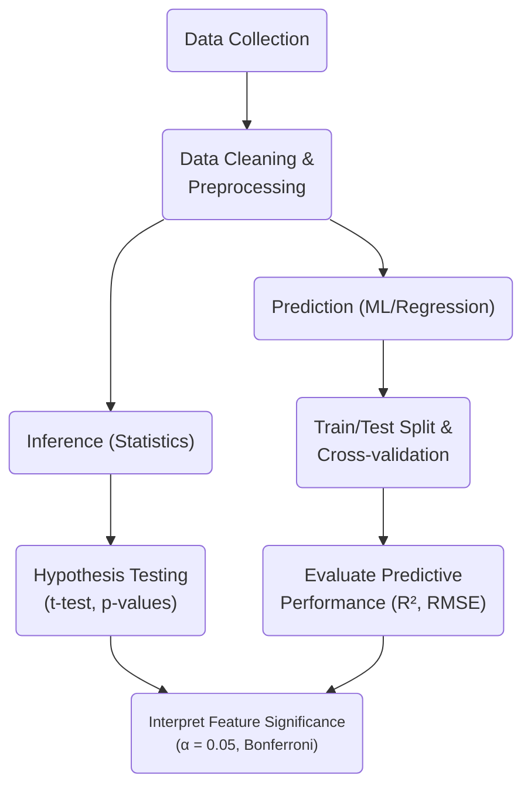

# Data Analysis on Calories Burned In the Gym

This project analyzes gym member workout data to explore differences in calorie expenditure between the genders and to predict calories burned.

---

## Featuring

- **Statistical Inference**  
  Conducted hypothesis testing using equal-tailed and one-sided t-tests to evaluate whether male and female gym members burn the same number of calories on average

- **Predictive Modeling**  
  Built linear regression model to predict calories burned from features such as age, BMI, workout type, and session duration

- **Feature Engineering & Preprocessing**  
  Applied ColumnTransformer from scikit-learn for handling categorical and numerical features

- **Visualization & EDA**  
  Used pandas, seaborn, and matplotlib for exploratory data analysis and visualizing relationships between workout attributes

---

---

## About the Data
"This dataset provides a detailed overview of gym members' exercise routines, physical attributes, and fitness metrics. It contains 973 
samples of gym data, including key performance indicators such as heart rate, calories burned, and workout duration. Each entry also 
includes demographic data and experience levels, allowing for comprehensive analysis of fitness patterns, athlete progression, and 
health trends."

From [Kaggle](https://www.kaggle.com/datasets/valakhorasani/gym-members-exercise-dataset)

---

## Overview

**Libraries used:**
pandas, scikit-learn, scipy, matplotlib, seaborn, statsmodels

